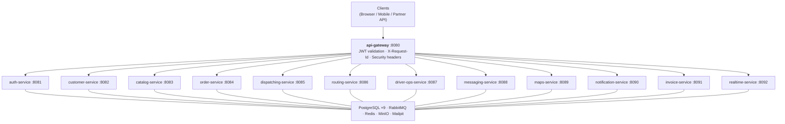

# Bakelivery

Multi-tenant bakery delivery platform built with Spring Boot 4 microservices.

## Architecture



## Service Port Reference

| Service                | Port |
|------------------------|------|
| api-gateway            | 8080 |
| auth-service           | 8081 |
| customer-service       | 8082 |
| catalog-service        | 8083 |
| order-service          | 8084 |
| dispatching-service    | 8085 |
| routing-service        | 8086 |
| driver-ops-service     | 8087 |
| messaging-service      | 8088 |
| maps-service           | 8089 |
| notification-service   | 8090 |
| invoice-service        | 8091 |
| realtime-service       | 8092 |
| RabbitMQ Management    | 15672|
| Mailpit UI             | 8025 |
| MinIO Console          | 9001 |
| Zipkin UI              | 9411 |
| Prometheus             | 9090 |
| Grafana                | 3000 |

## Quick Start

**Prerequisites:** Docker, Java 21, Gradle.

```bash
# 1. Start infrastructure
cd infra
docker compose up -d

# 2. Build and run all services
cd ..
./gradlew bootRun

# 3. Run unit tests
./gradlew test

# 4. Run integration tests (requires Docker for TestContainers)
./gradlew integrationTest
```

Open Grafana at http://localhost:3000 (admin/admin), Zipkin at http://localhost:9411.

## Environment Variables

| Variable                   | Default                              | Used by            |
|----------------------------|--------------------------------------|--------------------|
| `JWT_SECRET`               | (required)                           | auth-service       |
| `POSTGRES_URL`             | `jdbc:postgresql://localhost:5432/`  | all services       |
| `POSTGRES_USER`            | `bakelivery`                         | all services       |
| `POSTGRES_PASSWORD`        | (required)                           | all services       |
| `RABBITMQ_HOST`            | `localhost`                          | all services       |
| `RABBITMQ_PORT`            | `5672`                               | all services       |
| `REDIS_HOST`               | `localhost`                          | gateway, auth, etc |
| `REDIS_PORT`               | `6379`                               | gateway, auth, etc |
| `REDIS_SENTINEL_MASTER`    | `mymaster`                           | prod profile       |
| `REDIS_SENTINEL_NODES`     | `sentinel-1:26379,...`               | prod profile       |
| `MINIO_ENDPOINT`           | `http://localhost:9000`              | invoice, catalog   |
| `MINIO_ACCESS_KEY`         | `minioadmin`                         | invoice, catalog   |
| `MINIO_SECRET_KEY`         | `minioadmin`                         | invoice, catalog   |
| `MAIL_HOST`                | `localhost`                          | notification       |
| `MAIL_PORT`                | `1025`                               | notification       |
| `ZIPKIN_URL`               | `http://localhost:9411`              | all services       |
| `GOOGLE_MAPS_API_KEY`      | (required in prod)                   | maps-service       |

